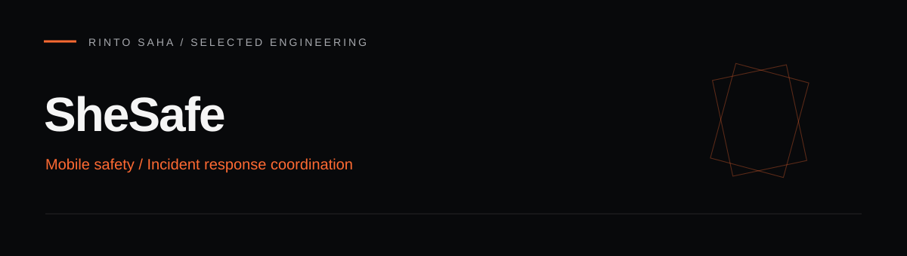

# SheSafe



A development prototype for personal safety workflows: incident reporting, location sharing, volunteer response, and incident messaging. The repository contains an Expo / React Native client and an Express / MySQL backend. Some internal directory and package names retain the earlier `resqher` name.

## Implemented source areas

- Incident creation, cancellation, resolution, responder acceptance, and history.
- Location context, nearby responder queries, and route/map support.
- Incident messaging, WebSocket delivery, and notifications.
- Authentication, account-status checks, volunteer approval, and administrative modules.
- Additional modules for emergency contacts, safe places, law-enforcement coordination, and AI-assisted safety information.

These describe code present in the repository, not certified emergency-service availability. Device permissions, database setup, and third-party integrations are required. No reliability or safety outcomes are claimed.

## Architecture

```text
Expo / React Native client
          |
          | HTTP APIs / WebSocket events
          v
Express route modules -> authentication and account checks
          |
          v
MySQL persistence + configured notification, media, map, and AI providers
```

| Directory | Purpose |
| --- | --- |
| `app/resqher-mobile/` | Expo Router application, screens, state, API clients, and device integrations |
| `backend/src/modules/` | Feature controllers, services, and routes |
| `backend/sql/` | Schema and ordered migration scripts |
| `backend/scripts/` | Migration and operational helpers |
| `android/` | Checked-in native Android project |

## Technologies

React Native, Expo, TypeScript, React Hook Form, Zod, Zustand, Express, MySQL, JWT, WebSocket, and configured Maps, Cloudinary, Twilio, and Gemini integrations. See the [mobile manifest](app/resqher-mobile/package.json) and [backend manifest](backend/package.json) for exact versions.

## Local development

Use a Node.js version compatible with the checked-in Expo SDK, npm, MySQL, and Android tooling for native features.

1. Copy `backend/.env.example` to `backend/.env`. Set database credentials, a strong JWT secret, allowed origins, and only the external integrations you intend to use.
2. Create a development MySQL database matching your configuration.
3. Install and initialize the backend:

```bash
cd backend
npm ci
npm run migrate
npm run dev
```

The migration script also includes seed files. Review `backend/scripts/migrate.js` before running it and use a disposable development database; do not point this setup at production data.

4. In another terminal, copy `app/resqher-mobile/.env.example` to `app/resqher-mobile/.env`. Set `EXPO_PUBLIC_API_URL` to a backend URL reachable from the device. Native and browser map keys must be restricted to their intended applications.

```bash
cd app/resqher-mobile
npm ci
npm start
```

Native integrations may require a development build instead of Expo Go. See the mobile scripts for Android device checks and builds.

## API entry points

`GET /api/health` checks the HTTP service. Feature routers are registered in [backend/src/app.js](backend/src/app.js). The [incident routes](backend/src/modules/incidents/incident.routes.js) and [controller](backend/src/modules/incidents/incident.controller.js) show the response workflow and dispatch boundaries. See [backend documentation](backend/README.md) for initial authentication endpoints.

## Configuration and security

The example environment files define the available keys. Keep database, JWT, Cloudinary, Twilio, Gemini, and server-side Maps secrets on the backend. `EXPO_PUBLIC_*` values are bundled into the client and cannot hold secrets. Use test accounts and synthetic locations in demos; never publish personal location histories, phone numbers, or production data.

This documentation pass did not run the application against a database, a physical device, or paid services. End-to-end emergency delivery and production security require separate validation. Do not rely on this prototype as a substitute for established emergency channels.

## Validation and maintenance

From `app/resqher-mobile`, run `npm run lint` and `npx tsc --noEmit`. Review available scripts before adding automated integration checks. Priorities include reproducible device tests, end-to-end incident lifecycle coverage, deployment hardening, and consent/privacy review.

## License and attribution

See [LICENSE](LICENSE). Repository authorship and contribution history remain in Git. The related earlier Laravel implementation is [ResQher](https://github.com/saha-rinto-604/ResQher); it is a separate codebase.
